# Maquina-Virtual
UNMDP - Facultad de Ingeniería MV1 2025 Arquitectura de Computadoras  
<h1 align="center">TRABAJO PRÁCTICO </h1>
<h2 align="center">MÁQUINA VIRTUAL - PARTE I</h2>
<h3>Introducción</h3>

&nbsp;&nbsp;&nbsp;&nbsp;El trabajo práctico consiste en realizar una aplicación, en un lenguaje de programación a elección, que emule la ejecución de un programa en el lenguaje máquina de una computadora que se describe en este documento. El programa a ejecutar se encuentra previamente escrito en el lenguaje Assembler de la máquina virtual y traducido a lenguaje máquina con el programa traductor (vmt) que provee la cátedra.

<h3>Procesos</h3>
<h3>&nbsp;&nbsp;&nbsp;&nbsp;TRADUCCIÓN (Traductor):</h3> 
debe leer el código fuente Assembler de un archivo de texto (*.asm), traducirlo a código máquina y generar otro archivo binario codificado (*.vmx), que es el programa que se ejecutará en la máquina virtual.

<h3>&nbsp;&nbsp;&nbsp;&nbsp;EJECUCIÓN (Máquina Virtual):</h3> 
debe leer el archivo generado por el Traductor (*.vmx), configurar la memoria principal y los registros, interpretar las instrucciones y emular su funcionamiento para producir los resultados de su ejecución.

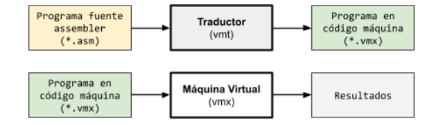

<h3>Traductor</h3>

&nbsp;&nbsp;&nbsp;&nbsp;El traductor, provisto por la cátedra, se utiliza desde una consola del siguiente modo:

vmt filename.asm [filename.vmx] [-o]

&nbsp;&nbsp;Donde: 

<ul>
  <li> <strong>vmt</strong> es el programa ejecutable del Traductor. </li>
  <li> <strong>filename.asm</strong> (obligatorio) es la ruta y nombre del archivo de texto donde está escrito el código fuente que será traducido (puede ser cualquier nombre con extensión .asm). </li>
  <li> <strong>filename.vmx</strong> (opcional) es la ruta y nombre del archivo generado por el Traductor, que contiene el programa en lenguaje máquina (puede ser cualquier nombre con extensión .vmx). Si se omite, se crea un archivo con el mismo nombre que el .asm pero con extensión .vmx. Si el archivo ya existe, se sobrescribe.</li>
  <li> <strong>-o</strong> (opcional) es un flag o bandera opcional para indicar que se omita la salida por pantalla de la traducción. Este flag no omite los mensajes de error producidos durante la traducción. </li>
</ul>

<h3>Máquina virtual</h3>

&nbsp;&nbsp;&nbsp;&nbsp;Se debe entregar el código fuente y el ejecutable compilado de la máquina virtual, la cual debe poder utilizarse desde una consola del siguiente modo: 

vmx filename.vmx [-d]

&nbsp;&nbsp;Donde: 

<ul>
  <li> <strong>vmx</strong> es el programa ejecutable del Ejecutor o Máquina Virtual.</li>
  <li> <strong>filename.vmx</strong> (obligatorio) es la ruta y nombre del archivo con el programa en lenguaje máquina (puede ser cualquier nombre con extensión .vmx). </li>
  <li> <strong>-d</strong> (opcional) es un flag que fuerza a la máquina virtual a mostrar el código desensamblado (disassembler), es decir, un código Assembler que se corresponde con el código máquina cargado en la memoria principal. </li>
</ul>

<h3>Componentes de la máquina virtual</h3>

&nbsp;&nbsp;&nbsp;&nbsp;La máquina virtual a implementar en esta primera parte, debe tener los siguientes componentes: 

<ul>
  <li>Memoria principal (RAM) de 16 KiB</li>
  <li>Tabla de descriptores de segmentos</li>
  <li>32 registros de 4 bytes (se utilizan 17 en esta primera parte)</li>
  <li>Procesador con capacidad para:
    <ul>
      <li>decodificar instrucciones en lenguaje máquina</li>
      <li>direccionar a cada byte de la memoria principal</li>
      <li>realizar operaciones aritméticas y lógicas en 32 bits</li>
    </ul>
  </li>
</ul>
<h3>Memoria principal</h3>

&nbsp;&nbsp;&nbsp;&nbsp; La memoria principal de la máquina es donde se encontrará íntegramente el código y los datos del programa en ejecución (proceso). La memoria deberá tener una capacidad para 16384 bytes (16 KiB). Las direcciones físicas de la memoria comienzan en 0 para acceder al primer byte (el byte más bajo) y 16383 para acceder al último (el byte más alto). 

&nbsp;&nbsp;&nbsp;&nbsp; En esta primera parte, el <strong>segmento de código</strong> contendrá el programa completo en lenguaje máquina y se ubicará al comienzo de la memoria, mientras que el <strong>segmento de datos</strong> ocupará todo el resto de la memoria disponible.

<h3>Tabla de descriptores de segmentos</h3>

&nbsp;&nbsp;&nbsp;&nbsp;La tabla de descriptores de segmentos permite definir la ubicación y el tamaño de cada segmento del proceso en la memoria principal. Consta de 8 entradas de 32 bits, cada una se divide en dos partes: los primeros 2 bytes son para guardar la dirección física de comienzo del segmento (base) y los siguientes 2 bytes la cantidad de bytes que ocupa. Se inicializa en el momento de la carga del programa.

&nbsp;&nbsp;&nbsp;&nbsp;En esta primera parte, la primera entrada (posición 0) guardará la información del segmento de código, mientras que la segunda (posición 1) guardará la información del segmento de datos. Es decir que la tabla quedará conformada de la siguiente manera: 

<table align="center">
  <thead>
    <tr>
      <th></th>
      <th>Base (2 bytes)</th>
      <th>Tamaño (2 bytes)</th>
    </tr>
  </thead>
  <tbody>
    <tr>
      <td>0</td>
      <td>0</td>
      <td>Tamaño del código</td>
    </tr>
    <tr>
      <td>1</td>
      <td>Tamaño del código</td>
      <td>16 KiB - Tamaño del código</td>
    </tr>
  </tbody>
</table>

<h3>Registros</h3>

&nbsp;&nbsp;&nbsp;&nbsp; Si bien en esta primera parte la máquina virtual utilizará solo 17 registros, deberá tener la capacidad para almacenar 32, los cuales se codifican de la siguiente manera:

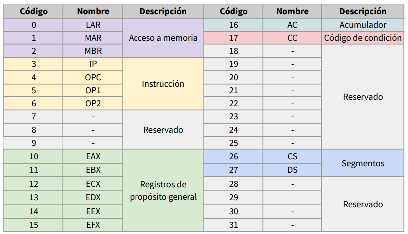

<h3>Programa</h3>

El programa es el resultado de la traducción y el punto de entrada de la máquina virtual. Por convención, tiene extensión <strong>.vmx</strong> para ser identificado fácilmente como un archivo ejecutable por la máquina virtual. Además del código en lenguaje máquina, el programa binario posee al comienzo una cabecera con la siguiente estructura:

<table align="center">
  <thead>
    <tr>
      <th>N°byte</th>
      <th>Campo</th>
      <th>Valor</th>
    </tr>
  </thead>
  <tbody>
    <tr>
      <td>0 - 4</td>
      <td>Identificador</td>
      <td>"VMX25"</td>
    </tr>
    <tr>
      <td>5</td>
      <td>Versión</td>
      <td>1</td>
    </tr>
    <tr>
      <td>6 - 7</td>
      <td>Tamaño del código</td>
      <td>—</td>
    </tr>
  </tbody>
</table>

<h2>Direcciones de memoria principal</h2>
<h3>Direcciones lógicas (punteros)</h3>

&nbsp;&nbsp;&nbsp;&nbsp;Cada segmento podría estar ubicado en cualquier parte de la memoria. Es por eso que el programa no puede tener una dirección física para acceder a una celda de memoria. En su lugar, debe utilizar <strong>direcciones lógicas</strong>, que son relativas a cada segmento. Durante la ejecución, la máquina virtual se encargará de traducir esa dirección lógica en una física y acceder a la celda de memoria específica. 

&nbsp;&nbsp;&nbsp;&nbsp;Por lo tanto, para acceder a la memoria se debe conocer el segmento y un desplazamiento dentro del mismo. Un puntero a memoria consta de 4 bytes: <strong>2 bytes para el código de segmento y 2 bytes para el desplazamiento</strong>. El código de segmento indica su posición en la tabla de descriptores de segmentos. Por ejemplo, para acceder al byte 8 del segmento de datos se deberá utilizar la dirección lógica 00 01 00 08 (hexadecimal). Si se debe acceder al byte 9 del segmento de código, se deberá utilizar la dirección lógica 00 00 00 09 (hexadecimal).

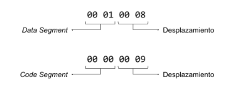

<h3>Direcciones físicas</h3>

&nbsp;&nbsp;&nbsp;&nbsp;La <strong>dirección física</strong> es directamente la posición de un byte en la memoria principal a partir de la cual se comienza a leer o escribir. Durante la ejecución, para acceder a un dato de la memoria, la máquina virtual debe traducir las direcciones lógicas en físicas en cada acceso. Para ello, se toma el código de segmento de la dirección lógica para obtener la dirección base del mismo, a través de la tabla de segmentos y, finalmente, se le suman los 16 bits menos significativos de la dirección lógica (el desplazamiento) para formar la dirección física de la memoria a la cual se debe acceder. Por ejemplo: 

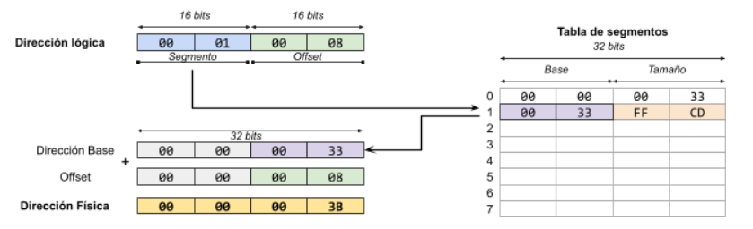

&nbsp;&nbsp;&nbsp;&nbsp;Luego de obtener la dirección física, y sabiendo cuántos bytes van a acceder, ya sea para lectura o escritura de la memoria, la máquina virtual debe garantizar que el acceso se encuentre dentro del segmento especificado en la dirección lógica, para ello debe utilizar el tamaño del segmento. por ejemplo, si se quieren acceder a 4 bytes desde la dirección física del ejemplo anterior:

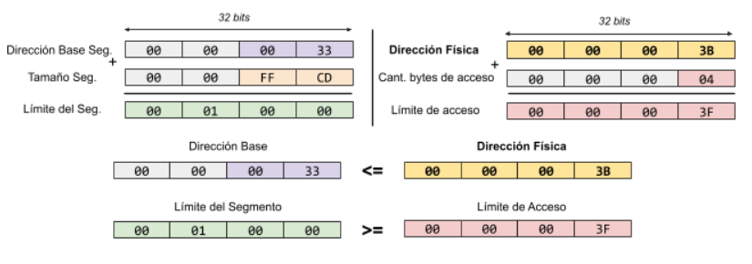

<h3>Instrucciones en lenguaje máquina</h3>

&nbsp;&nbsp;&nbsp;&nbsp;Cada instrucción en lenguaje máquina se compone de un código de operación y sus operandos. Existen instrucciones con dos operandos, un operando o ninguno. El primer byte de la instrucción siempre contendrá los tipos de operandos y el código de operación, codificados de la siguiente manera:

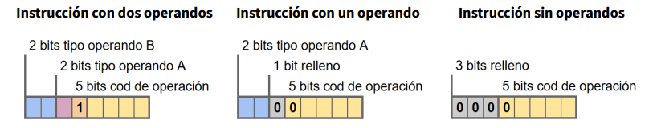

&nbsp;&nbsp;&nbsp;&nbsp; Luego, los siguientes bytes contienen los operandos. <strong>La instrucción no tiene una longitud fija</strong>, sino que dependerá de la cantidad y los tipos de sus operandos. Tanto los operandos como sus tipos se codifican en lenguaje máquina en el orden inverso al que se encuentran en el lenguaje Assembler.

<h3>Códigos de operación</h3>

&nbsp;&nbsp;&nbsp;&nbsp; El lenguaje Assembler es una representación del lenguaje máquina, donde las instrucciones se describen con un <strong>mnemónico</strong>. En esta primera parte solo se implementarán 26 instrucciones, las cuales se listan a continuación junto con sus códigos de operación en hexadecimal.

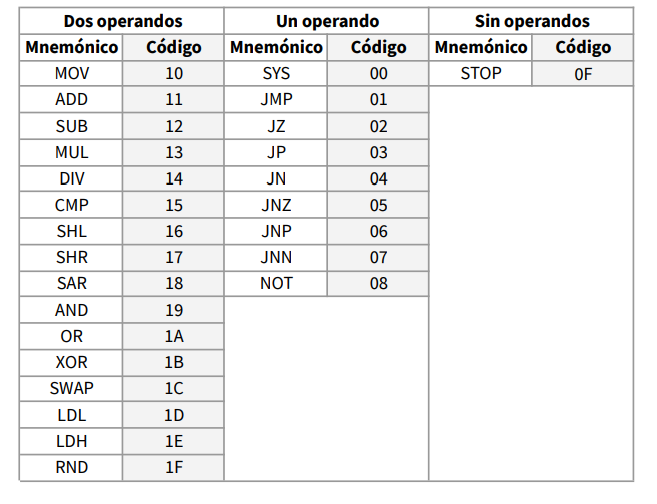

<h3>Operandos</h3>

&nbsp;&nbsp;&nbsp;&nbsp;La máquina virtual admite tres tipos de operandos, que codifican de la siguiente manera:

<table align="center">
  <thead>
    <tr>
      <th>Código binario</th>
      <th>Tipo</th>
      <th>Tamaño</th>
    </tr>
  </thead>
  <tbody>
    <tr>
      <td>00</td>
      <td>ninguno</td>
      <td>0 bytes</td>
    </tr>
    <tr>
      <td>01</td>
      <td>registro</td>
      <td>1byte</td>
    </tr>
    <tr>
      <td>10</td>
      <td>inmediato</td>
      <td>2 bytes</td>
    </tr>
    <tr>
      <td>11</td>
      <td>memoria</td>
      <td>3 bytes</td>
    </tr>
  </tbody>
</table>

&nbsp;&nbsp;&nbsp;&nbsp;<strong>NOTA:</strong> el tamaño del operando en bytes coincide con su correspondiente código binario.

&nbsp;&nbsp;&nbsp;&nbsp;<strong>Operando de registro:</strong> su valor es el código del registro al cual se accede.

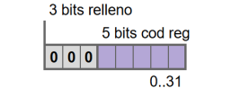

&nbsp;&nbsp;&nbsp;&nbsp;<strong>Operando inmediato:</strong>  su valor es directamente el valor del operando.

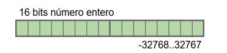

&nbsp;&nbsp;&nbsp;&nbsp;<strong>Operando de memoria:</strong> su valor se compone por el código del registro y el desplazamiento correspondientes. La posición en la memoria principal a la cual se accede es relativa al comienzo de algún segmento (es decir, una dirección lógica).

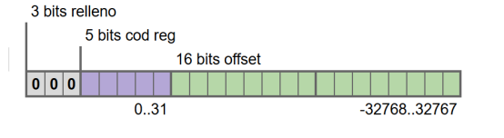

<h3>Ejemplos</h3>

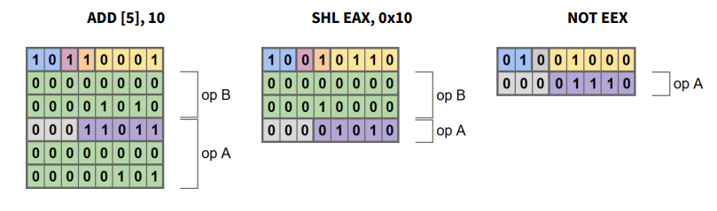

<h3>Llamadas al sistema</h3>

&nbsp;&nbsp;&nbsp;&nbsp;La instrucción SYS, en esta primera parte, debe soportar las llamadas al sistema READ (1) y WRITE (2). En ambos casos, la posición de memoria inicial estará indicada en EDX y el modo de lectura/escritura en EAX, mientras que ECX contendrá la cantidad de celdas en los 2 bytes menos significativos y el tamaño de las mismas en los 2 bytes más significativos. En la pantalla se debe mostrar un prompt ([XXXX]:) de 4 dígitos hexadecimales, que indique la dirección física de la celda en la que se encuentra cada dato.

<h3>Ejecución</h3>

&nbsp;&nbsp;&nbsp;&nbsp;Inicialmente, la máquina virtual debe leer el encabezado del programa para verificar si es capaz de ejecutar el programa y, de ser así, cargar el código en la memoria principal, armar la tabla de descriptores de segmentos e inicializar los registros.

&nbsp;&nbsp;&nbsp;&nbsp;Los registros CS y DS se cargan con punteros al comienzo del segmento de código y del segmento de datos, respectivamente. Es decir, en los 16 bits más significativos deberán almacenarse las posiciones de la tabla de descriptores de segmentos, mientras que los 16 bits menos significativos se rellenan con 0. Por lo tanto, CS será igual a 00 00 00 00 y DS será igual a 00 01 00 00 (en hexadecimal). Por otro lado, el registro IP debe inicializarse con un puntero a la primera instrucción del código. En otras palabras, al comienzo de la ejecución deberá tener el mismo valor que el registro CS.

&nbsp;&nbsp;&nbsp;&nbsp;A continuación comenzará la ejecución, la cual consiste en:

<ul>
  <li>Leer la instrucción apuntada por el registro IP</li>
  <li>Almacenar el código de operación de la instrucción en el registro OPC </li>
  <li>Guardar en los registros OP1 y OP2 los operandos A y B, respectivamente:
    <ul>
      <li>el byte más significativo del registro contendrá el código binario del tipo de operando</li>
      <li>en los restantes tres bytes quedará el valor del operando, tal cual como está codificado en la instrucción almacenada en la memoria principal </li>
      <li>en el caso de que el operando no exista, el registro tendrá un 0 </li>
    </ul>  
  </li>
  <li>Ubicar el registro IP en la próxima instrucción (sumar el tamaño de la instrucción actual)</li>
  <li>Realizar la operación correspondiente a la instrucción</li>
</ul>

&nbsp;&nbsp;&nbsp;&nbsp;La ejecución se debe repetir hasta que el registro IP apunte fuera del segmento de código. Si se ejecuta una instrucción STOP, la máquina virtual debe asignar un -1 (0xFFFFFFFF) al registro IP. De esta manera, el código de segmento dejará de corresponderse con el segmento de código o con cualquier otro de los que podrían almacenarse en la tabla de descriptores de segmentos.

&nbsp;&nbsp;&nbsp;&nbsp;Cada vez que se realiza una operación en la memoria, se debe cargar en el registro LAR la dirección lógica a la que se quiere acceder y la cantidad de bytes en la parte alta del registro MAR (los 2 bytes más significativos). Luego de realizar la traducción a una dirección física, el resultado debe almacenarse en la parte baja del registro MAR (los 2 bytes menos significativos). En el registro MBR debe quedar el valor con el cual se está operando, ya sea el valor que se desea almacenar en el caso de una escritura o el que se obtuvo después de la lectura. La lectura de la instrucción no debe modificar ninguno de estos registros.

&nbsp;&nbsp;&nbsp;&nbsp;El registro CC debe informar sobre el resultado de la última operación matemática o lógica ejecutada. De los 32 bits que posee, solamente se usarán los primeros dos. El bit más significativo es el indicador de signo (bit N), que valdrá 1 cuando la última operación matemática o lógica haya dado por resultado un valor negativo y 0 en cualquier otro caso. El segundo bit más significativo es el indicador de cero (bit Z), que valdrá 1 cuando la última operación matemática o lógica haya dado por resultado cero y 0 en cualquier otro caso.

<h3>Errores</h3>

&nbsp;&nbsp;&nbsp;&nbsp;La máquina virtual debe ser capaz de detectar, al menos, los siguientes errores:

<ul>
  <li><strong>Instrucción inválida:</strong> cuando el código de operación de la instrucción a ejecutar no existe.</li>
  <li><strong>División por cero:</strong> cuando al ejecutar la instrucción DIV, el valor del segundo operando es 0.</li>
  <li><strong>Fallo de segmento:</strong> cuando el código de segmento de una dirección lógica excede el tamaño de la tabla de descriptores o cuando la dirección física apunta a un byte que se encuentra fuera de los límites del segmento, excepto en el caso de la lectura de la instrucción.</li>
</ul>

&nbsp;&nbsp;&nbsp;&nbsp;Ante la ocurrencia de cualquiera de estos errores, la máquina virtual debe informarlo e inmediatamente abortar la ejecución del proceso.

<h3>Disassembler</h3>

&nbsp;&nbsp;&nbsp;&nbsp;Si a la máquina virtual se le indica que muestre el código Assembler (-d), deberá mostrar una línea por cada instrucción con el siguiente formato: 

[0000] XX XX XX XX &nbsp;&nbsp;&nbsp;&nbsp;| MNEM&nbsp;&nbsp; OP_A,&nbsp;&nbsp; OP_B

<ul>
  <li><strong>[0000]</strong> es la dirección física de memoria donde está alojada la instrucción, expresada con 4 dígitos hexadecimales.</li>
  <li><strong>XX XX XX XX</strong> es la instrucción completa (de longitud variable) en hexadecimal, agrupada por bytes. </li>
  <li><strong>MNEM</strong> es el mnemónico correspondiente al código de la instrucción. </li>
  <li><strong>OP_A</strong> y <strong>OP_B</strong> son los operandos A y B, respectivamente, expresados en decimal.</li>
</ul>

&nbsp;&nbsp;&nbsp;&nbsp;Por ejemplo:

[0000] B1 00 0A 1B 00 05 &nbsp;&nbsp;&nbsp;&nbsp;| ADD &nbsp;&nbsp; [DS+5],&nbsp;&nbsp; 10

[0006] 96 00 10 0A &nbsp;&nbsp;&nbsp;&nbsp;| SHL &nbsp;&nbsp; EAX, &nbsp;&nbsp; 16

[000A] 48 0E &nbsp;&nbsp;&nbsp;&nbsp;| NOT &nbsp;&nbsp; EEX

&nbsp;&nbsp;&nbsp;&nbsp;Los rótulos, comentarios y constantes con formato no pueden ser mostrados tal cual fueron escritos en el código Assembler porque no existen en el código máquina.

