# Maquina-Virtual
UNMDP - Facultad de Ingeniería MV1 2025 Arquitectura de Computadoras  
<h1 align="center">TRABAJO PRÁCTICO </h1>
<h2 align="center">MÁQUINA VIRTUAL - PARTE I</h2>
<h3>Introducción</h3>

&nbsp;&nbsp;&nbsp;&nbsp;El trabajo práctico consiste en realizar una aplicación, en un lenguaje de programación a elección, que emule la ejecución de un programa en el lenguaje máquina de una computadora que se describe en este documento. El programa a ejecutar se encuentra previamente escrito en el lenguaje Assembler de la máquina virtual y traducido a lenguaje máquina con el programa traductor (vmt) que provee la cátedra.

<h3>Procesos</h3>
<h3>&nbsp;&nbsp;&nbsp;&nbsp;TRADUCCIÓN (Traductor):</h3> 
debe leer el código fuente Assembler de un archivo de texto (*.asm), traducirlo a código máquina y generar otro archivo binario codificado (*.vmx), que es el programa que se ejecutará en la máquina virtual.

<h3>&nbsp;&nbsp;&nbsp;&nbsp;EJECUCIÓN (Máquina Virtual):</h3> 
debe leer el archivo generado por el Traductor (*.vmx), configurar la memoria principal y los registros, interpretar las instrucciones y emular su funcionamiento para producir los resultados de su ejecución.

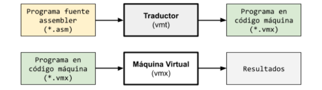

<h3>Traductor</h3>

&nbsp;&nbsp;&nbsp;&nbsp;El traductor, provisto por la cátedra, se utiliza desde una consola del siguiente modo:

vmt filename.asm [filename.vmx] [-o]

&nbsp;&nbsp;Donde: 

<ul>
  <li> <strong>vmt</strong> es el programa ejecutable del Traductor. </li>
  <li> <strong>filename.asm</strong> (obligatorio) es la ruta y nombre del archivo de texto donde está escrito el código fuente que será traducido (puede ser cualquier nombre con extensión .asm). </li>
  <li> <strong>filename.vmx</strong> (opcional) es la ruta y nombre del archivo generado por el Traductor, que contiene el programa en lenguaje máquina (puede ser cualquier nombre con extensión .vmx). Si se omite, se crea un archivo con el mismo nombre que el .asm pero con extensión .vmx. Si el archivo ya existe, se sobrescribe.</li>
  <li> <strong>-o</strong> (opcional) es un flag o bandera opcional para indicar que se omita la salida por pantalla de la traducción. Este flag no omite los mensajes de error producidos durante la traducción. </li>
</ul>

<h3>Máquina virtual</h3>

&nbsp;&nbsp;&nbsp;&nbsp;Se debe entregar el código fuente y el ejecutable compilado de la máquina virtual, la cual debe poder utilizarse desde una consola del siguiente modo: 

vmx filename.vmx [-d]

&nbsp;&nbsp;Donde: 

<ul>
  <li> <strong>vmx</strong> es el programa ejecutable del Ejecutor o Máquina Virtual.</li>
  <li> <strong>filename.vmx</strong> (obligatorio) es la ruta y nombre del archivo con el programa en lenguaje máquina (puede ser cualquier nombre con extensión .vmx). </li>
  <li> <strong>-d</strong> (opcional) es un flag que fuerza a la máquina virtual a mostrar el código desensamblado (disassembler), es decir, un código Assembler que se corresponde con el código máquina cargado en la memoria principal. </li>
</ul>

<h3>Componentes de la máquina virtual</h3>

&nbsp;&nbsp;&nbsp;&nbsp;La máquina virtual a implementar en esta primera parte, debe tener los siguientes componentes: 

<ul>
  <li>Memoria principal (RAM) de 16 KiB</li>
  <li>Tabla de descriptores de segmentos</li>
  <li>32 registros de 4 bytes (se utilizan 17 en esta primera parte)</li>
  <li>Procesador con capacidad para:
    <ul>
      <li>decodificar instrucciones en lenguaje máquina</li>
      <li>direccionar a cada byte de la memoria principal</li>
      <li>realizar operaciones aritméticas y lógicas en 32 bits</li>
    </ul>
  </li>
</ul>
<h3>Memoria principal</h3>

&nbsp;&nbsp;&nbsp;&nbsp; La memoria principal de la máquina es donde se encontrará íntegramente el código y los datos del programa en ejecución (proceso). La memoria deberá tener una capacidad para 16384 bytes (16 KiB). Las direcciones físicas de la memoria comienzan en 0 para acceder al primer byte (el byte más bajo) y 16383 para acceder al último (el byte más alto). 

&nbsp;&nbsp;&nbsp;&nbsp; En esta primera parte, el <strong>segmento de código</strong> contendrá el programa completo en lenguaje máquina y se ubicará al comienzo de la memoria, mientras que el <strong>segmento de datos</strong> ocupará todo el resto de la memoria disponible.

<h3>Tabla de descriptores de segmentos</h3>

&nbsp;&nbsp;&nbsp;&nbsp;La tabla de descriptores de segmentos permite definir la ubicación y el tamaño de cada segmento del proceso en la memoria principal. Consta de 8 entradas de 32 bits, cada una se divide en dos partes: los primeros 2 bytes son para guardar la dirección física de comienzo del segmento (base) y los siguientes 2 bytes la cantidad de bytes que ocupa. Se inicializa en el momento de la carga del programa.

&nbsp;&nbsp;&nbsp;&nbsp;En esta primera parte, la primera entrada (posición 0) guardará la información del segmento de código, mientras que la segunda (posición 1) guardará la información del segmento de datos. Es decir que la tabla quedará conformada de la siguiente manera: 

<table align="center">
  <thead>
    <tr>
      <th></th>
      <th>Base (2 bytes)</th>
      <th>Tamaño (2 bytes)</th>
    </tr>
  </thead>
  <tbody>
    <tr>
      <td>0</td>
      <td>0</td>
      <td>Tamaño del código</td>
    </tr>
    <tr>
      <td>1</td>
      <td>Tamaño del código</td>
      <td>16 KiB - Tamaño del código</td>
    </tr>
  </tbody>
</table>

<h3>Registros</h3>

&nbsp;&nbsp;&nbsp;&nbsp; Si bien en esta primera parte la máquina virtual utilizará solo 17 registros, deberá tener la capacidad para almacenar 32, los cuales se codifican de la siguiente manera:

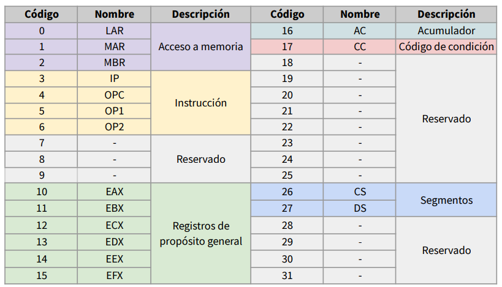

<h3>Programa</h3>

El programa es el resultado de la traducción y el punto de entrada de la máquina virtual. Por convención, tiene extensión <strong>.vmx</strong> para ser identificado fácilmente como un archivo ejecutable por la máquina virtual. Además del código en lenguaje máquina, el programa binario posee al comienzo una cabecera con la siguiente estructura:

<table align="center">
  <thead>
    <tr>
      <th>N°byte</th>
      <th>Campo</th>
      <th>Valor</th>
    </tr>
  </thead>
  <tbody>
    <tr>
      <td>0 - 4</td>
      <td>Identificador</td>
      <td>"VMX25"</td>
    </tr>
    <tr>
      <td>5</td>
      <td>Versión</td>
      <td>1</td>
    </tr>
    <tr>
      <td>6 - 7</td>
      <td>Tamaño del código</td>
      <td>—</td>
    </tr>
  </tbody>
</table>

<h2>Direcciones de memoria principal</h2>
<h3>Direcciones lógicas (punteros)</h3>

&nbsp;&nbsp;&nbsp;&nbsp;Cada segmento podría estar ubicado en cualquier parte de la memoria. Es por eso que el programa no puede tener una dirección física para acceder a una celda de memoria. En su lugar, debe utilizar <strong>direcciones lógicas</strong>, que son relativas a cada segmento. Durante la ejecución, la máquina virtual se encargará de traducir esa dirección lógica en una física y acceder a la celda de memoria específica. 

&nbsp;&nbsp;&nbsp;&nbsp;Por lo tanto, para acceder a la memoria se debe conocer el segmento y un desplazamiento dentro del mismo. Un puntero a memoria consta de 4 bytes: <strong>2 bytes para el código de segmento y 2 bytes para el desplazamiento</strong>. El código de segmento indica su posición en la tabla de descriptores de segmentos. Por ejemplo, para acceder al byte 8 del segmento de datos se deberá utilizar la dirección lógica 00 01 00 08 (hexadecimal). Si se debe acceder al byte 9 del segmento de código, se deberá utilizar la dirección lógica 00 00 00 09 (hexadecimal).

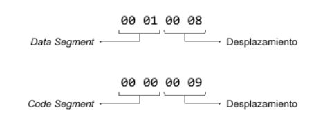

<h3>Direcciones físicas</h3>

&nbsp;&nbsp;&nbsp;&nbsp;La <strong>dirección física</strong> es directamente la posición de un byte en la memoria principal a partir de la cual se comienza a leer o escribir. Durante la ejecución, para acceder a un dato de la memoria, la máquina virtual debe traducir las direcciones lógicas en físicas en cada acceso. Para ello, se toma el código de segmento de la dirección lógica para obtener la dirección base del mismo, a través de la tabla de segmentos y, finalmente, se le suman los 16 bits menos significativos de la dirección lógica (el desplazamiento) para formar la dirección física de la memoria a la cual se debe acceder. Por ejemplo: 

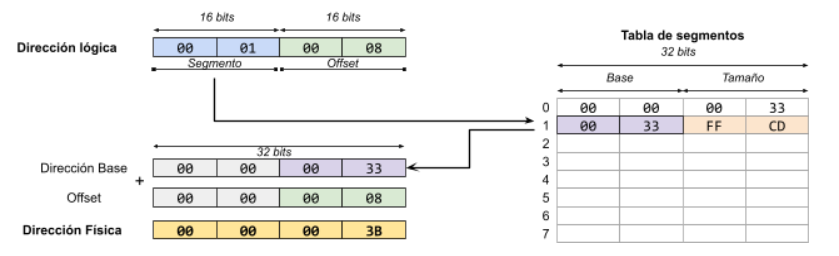

&nbsp;&nbsp;&nbsp;&nbsp;Luego de obtener la dirección física, y sabiendo cuántos bytes van a acceder, ya sea para lectura o escritura de la memoria, la máquina virtual debe garantizar que el acceso se encuentre dentro del segmento especificado en la dirección lógica, para ello debe utilizar el tamaño del segmento. por ejemplo, si se quieren acceder a 4 bytes desde la dirección física del ejemplo anterior:

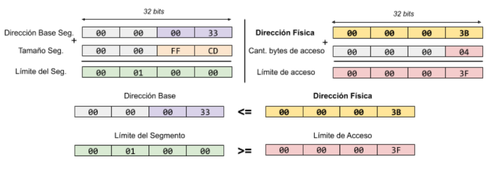

<h3>Instrucciones en lenguaje máquina</h3>

&nbsp;&nbsp;&nbsp;&nbsp;Cada instrucción en lenguaje máquina se compone de un código de operación y sus operandos. Existen instrucciones con dos operandos, un operando o ninguno. El primer byte de la instrucción siempre contendrá los tipos de operandos y el código de operación, codificados de la siguiente manera:

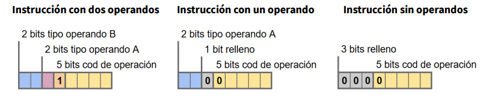

&nbsp;&nbsp;&nbsp;&nbsp; Luego, los siguientes bytes contienen los operandos. <strong>La instrucción no tiene una longitud fija</strong>, sino que dependerá de la cantidad y los tipos de sus operandos. Tanto los operandos como sus tipos se codifican en lenguaje máquina en el orden inverso al que se encuentran en el lenguaje Assembler.

<h3>Códigos de operación</h3>

&nbsp;&nbsp;&nbsp;&nbsp; El lenguaje Assembler es una representación del lenguaje máquina, donde las instrucciones se describen con un <strong>mnemónico</strong>. En esta primera parte solo se implementarán 26 instrucciones, las cuales se listan a continuación junto con sus códigos de operación en hexadecimal.

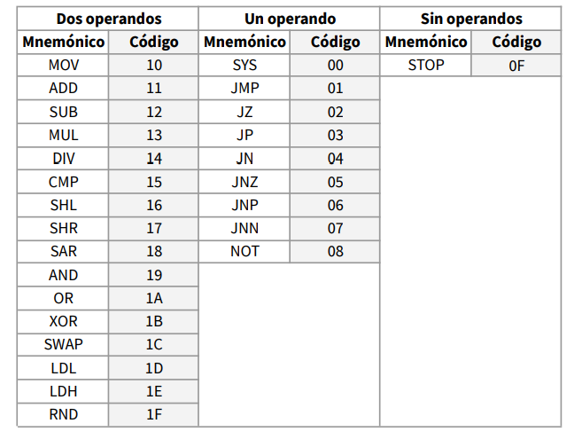

<h3>Operandos</h3>

&nbsp;&nbsp;&nbsp;&nbsp;La máquina virtual admite tres tipos de operandos, que codifican de la siguiente manera:

<table align="center">
  <thead>
    <tr>
      <th>Código binario</th>
      <th>Tipo</th>
      <th>Tamaño</th>
    </tr>
  </thead>
  <tbody>
    <tr>
      <td>00</td>
      <td>ninguno</td>
      <td>0 bytes</td>
    </tr>
    <tr>
      <td>01</td>
      <td>registro</td>
      <td>1byte</td>
    </tr>
    <tr>
      <td>10</td>
      <td>inmediato</td>
      <td>2 bytes</td>
    </tr>
    <tr>
      <td>11</td>
      <td>memoria</td>
      <td>3 bytes</td>
    </tr>
  </tbody>
</table>

&nbsp;&nbsp;&nbsp;&nbsp;<strong>NOTA:</strong> el tamaño del operando en bytes coincide con su correspondiente código binario.

&nbsp;&nbsp;&nbsp;&nbsp;<strong>Operando de registro:</strong> su valor es el código del registro al cual se accede.

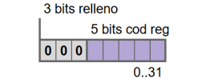

&nbsp;&nbsp;&nbsp;&nbsp;<strong>Operando inmediato:</strong>  su valor es directamente el valor del operando.

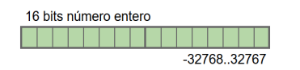

&nbsp;&nbsp;&nbsp;&nbsp;<strong>Operando de memoria:</strong> su valor se compone por el código del registro y el desplazamiento correspondientes. La posición en la memoria principal a la cual se accede es relativa al comienzo de algún segmento (es decir, una dirección lógica).

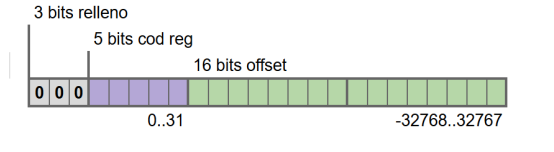

<h3>Ejemplos</h3>

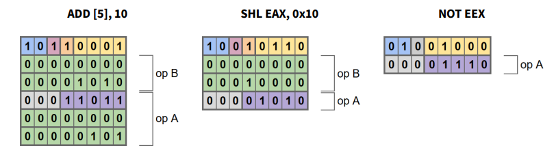

<h3>Llamadas al sistema</h3>

&nbsp;&nbsp;&nbsp;&nbsp;La instrucción SYS, en esta primera parte, debe soportar las llamadas al sistema READ (1) y WRITE (2). En ambos casos, la posición de memoria inicial estará indicada en EDX y el modo de lectura/escritura en EAX, mientras que ECX contendrá la cantidad de celdas en los 2 bytes menos significativos y el tamaño de las mismas en los 2 bytes más significativos. En la pantalla se debe mostrar un prompt ([XXXX]:) de 4 dígitos hexadecimales, que indique la dirección física de la celda en la que se encuentra cada dato.

<h3>Ejecución</h3>

&nbsp;&nbsp;&nbsp;&nbsp;Inicialmente, la máquina virtual debe leer el encabezado del programa para verificar si es capaz de ejecutar el programa y, de ser así, cargar el código en la memoria principal, armar la tabla de descriptores de segmentos e inicializar los registros.

&nbsp;&nbsp;&nbsp;&nbsp;Los registros CS y DS se cargan con punteros al comienzo del segmento de código y del segmento de datos, respectivamente. Es decir, en los 16 bits más significativos deberán almacenarse las posiciones de la tabla de descriptores de segmentos, mientras que los 16 bits menos significativos se rellenan con 0. Por lo tanto, CS será igual a 00 00 00 00 y DS será igual a 00 01 00 00 (en hexadecimal). Por otro lado, el registro IP debe inicializarse con un puntero a la primera instrucción del código. En otras palabras, al comienzo de la ejecución deberá tener el mismo valor que el registro CS.

&nbsp;&nbsp;&nbsp;&nbsp;A continuación comenzará la ejecución, la cual consiste en:

<ul>
  <li>Leer la instrucción apuntada por el registro IP</li>
  <li>Almacenar el código de operación de la instrucción en el registro OPC </li>
  <li>Guardar en los registros OP1 y OP2 los operandos A y B, respectivamente:
    <ul>
      <li>el byte más significativo del registro contendrá el código binario del tipo de operando</li>
      <li>en los restantes tres bytes quedará el valor del operando, tal cual como está codificado en la instrucción almacenada en la memoria principal </li>
      <li>en el caso de que el operando no exista, el registro tendrá un 0 </li>
    </ul>  
  </li>
  <li>Ubicar el registro IP en la próxima instrucción (sumar el tamaño de la instrucción actual)</li>
  <li>Realizar la operación correspondiente a la instrucción</li>
</ul>

&nbsp;&nbsp;&nbsp;&nbsp;La ejecución se debe repetir hasta que el registro IP apunte fuera del segmento de código. Si se ejecuta una instrucción STOP, la máquina virtual debe asignar un -1 (0xFFFFFFFF) al registro IP. De esta manera, el código de segmento dejará de corresponderse con el segmento de código o con cualquier otro de los que podrían almacenarse en la tabla de descriptores de segmentos.

&nbsp;&nbsp;&nbsp;&nbsp;Cada vez que se realiza una operación en la memoria, se debe cargar en el registro LAR la dirección lógica a la que se quiere acceder y la cantidad de bytes en la parte alta del registro MAR (los 2 bytes más significativos). Luego de realizar la traducción a una dirección física, el resultado debe almacenarse en la parte baja del registro MAR (los 2 bytes menos significativos). En el registro MBR debe quedar el valor con el cual se está operando, ya sea el valor que se desea almacenar en el caso de una escritura o el que se obtuvo después de la lectura. La lectura de la instrucción no debe modificar ninguno de estos registros.

&nbsp;&nbsp;&nbsp;&nbsp;El registro CC debe informar sobre el resultado de la última operación matemática o lógica ejecutada. De los 32 bits que posee, solamente se usarán los primeros dos. El bit más significativo es el indicador de signo (bit N), que valdrá 1 cuando la última operación matemática o lógica haya dado por resultado un valor negativo y 0 en cualquier otro caso. El segundo bit más significativo es el indicador de cero (bit Z), que valdrá 1 cuando la última operación matemática o lógica haya dado por resultado cero y 0 en cualquier otro caso.

<h3>Errores</h3>

&nbsp;&nbsp;&nbsp;&nbsp;La máquina virtual debe ser capaz de detectar, al menos, los siguientes errores:

<ul>
  <li><strong>Instrucción inválida:</strong> cuando el código de operación de la instrucción a ejecutar no existe.</li>
  <li><strong>División por cero:</strong> cuando al ejecutar la instrucción DIV, el valor del segundo operando es 0.</li>
  <li><strong>Fallo de segmento:</strong> cuando el código de segmento de una dirección lógica excede el tamaño de la tabla de descriptores o cuando la dirección física apunta a un byte que se encuentra fuera de los límites del segmento, excepto en el caso de la lectura de la instrucción.</li>
</ul>

&nbsp;&nbsp;&nbsp;&nbsp;Ante la ocurrencia de cualquiera de estos errores, la máquina virtual debe informarlo e inmediatamente abortar la ejecución del proceso.

<h3>Disassembler</h3>

&nbsp;&nbsp;&nbsp;&nbsp;Si a la máquina virtual se le indica que muestre el código Assembler (-d), deberá mostrar una línea por cada instrucción con el siguiente formato: 

[0000] XX XX XX XX &nbsp;&nbsp;&nbsp;&nbsp;| MNEM&nbsp;&nbsp; OP_A,&nbsp;&nbsp; OP_B

<ul>
  <li><strong>[0000]</strong> es la dirección física de memoria donde está alojada la instrucción, expresada con 4 dígitos hexadecimales.</li>
  <li><strong>XX XX XX XX</strong> es la instrucción completa (de longitud variable) en hexadecimal, agrupada por bytes. </li>
  <li><strong>MNEM</strong> es el mnemónico correspondiente al código de la instrucción. </li>
  <li><strong>OP_A</strong> y <strong>OP_B</strong> son los operandos A y B, respectivamente, expresados en decimal.</li>
</ul>

&nbsp;&nbsp;&nbsp;&nbsp;Por ejemplo:

[0000] B1 00 0A 1B 00 05 &nbsp;&nbsp;&nbsp;&nbsp;| ADD &nbsp;&nbsp; [DS+5],&nbsp;&nbsp; 10

[0006] 96 00 10 0A &nbsp;&nbsp;&nbsp;&nbsp;| SHL &nbsp;&nbsp; EAX, &nbsp;&nbsp; 16

[000A] 48 0E &nbsp;&nbsp;&nbsp;&nbsp;| NOT &nbsp;&nbsp; EEX

&nbsp;&nbsp;&nbsp;&nbsp;Los rótulos, comentarios y constantes con formato no pueden ser mostrados tal cual fueron escritos en el código Assembler porque no existen en el código máquina.

<h1 align="center">TRABAJO PRÁCTICO </h1>
<h2 align="center">MÁQUINA VIRTUAL - PARTE II</h2>
<h3>Introducción</h3>

&nbsp;&nbsp;&nbsp;&nbsp;En esta segunda parte se deberá ampliar la máquina virtual para que, además de ejecutar un
programa desde el comienzo, pueda cargar la imagen de un proceso y continuar su ejecución. También
deberá brindar soporte a un proceso con hasta seis segmentos, manejo de pila con nuevas instrucciones
y sus respectivos registros, modificadores sobre los operandos, nuevas llamadas al sistema para lectura y
escritura de strings, limpiar consola y definir breakpoints.

<h3>Máquina virtual</h3>

Se debe entregar el código fuente y el ejecutable compilado de la máquina virtual, la cual debe poder
utilizarse desde una consola del siguiente modo:

vmx [filename.vmx] [filename.vmi] [m=M] [-d] [-p param1 param2 ... paramN]

&nbsp;&nbsp;Donde: 

<ul>
  <li> <strong>vmx</strong> es el programa ejecutable del proceso Ejecutor o Máquina Virtual. </li>
  <li> <strong>filename.vmx</strong> (opcional*) es la ruta y nombre del archivo con el programa en lenguaje máquina (puede ser cualquier nombre con extensión .vmx).</li>
  <li> <strong>filename.vmi</strong> (opcional*) es la ruta y nombre del archivo donde se almacenará la imagen de la máquina virtual (puede ser cualquier nombre con extensión .vmi).</li>
  <li> <strong>m=M</strong> (opcional) permite indicar el tamaño de la memoria principal, donde M es un valor expresado en KiB. Si se omite, el valor por defecto sigue siendo 16 KiB. </li>
  <li> <strong>-d</strong> (opcional) es un flag que fuerza a la máquina virtual a mostrar el código Assembler correspondiente al código máquina cargado en la memoria principal.</li>
  <li> <strong>-p</strong> (opcional) es un flag que sirve para indicar los parámetros (param1 param2 ... paramN) que se le deben pasar a la subrutina principal del proceso. Siempre se debe escribir al final del comando. </li>
</ul>

&nbsp;&nbsp;<strong>Nota:</strong> para la ejecución es obligatorio al menos uno de los dos archivos: .vmx y/o .vmi. En caso de no
especificarse un archivo .vmx, se ignoran los parámetros -p.

<h3>Descripción de la máquina virtual</h3>

&nbsp;&nbsp;&nbsp;&nbsp;La máquina virtual a implementar en esta segunda parte, debe tener los siguientes componentes: 

<ul>
  <li>Memoria principal (RAM) de tamaño variable</li>
  <li>Tabla de descriptores de segmentos</li>
  <li>32 registros de 4 bytes</li>
  <li>Procesador con capacidad para:
    <ul>
      <li>decodificar instrucciones en lenguaje máquina</li>
      <li>direccionar a cada byte de la memoria principal</li>
      <li>realizar operaciones aritméticas y lógicas en 32 bits</li>
    </ul>
  </li>
</ul>

<h3>Archivos de entrada</h3>
<h3>Programa (vmx)</h3>

&nbsp;&nbsp;&nbsp;&nbsp;El programa binario de esta segunda parte contará con una nueva cabecera (header) que incorporará
nueva información respecto de la primera parte. La máquina virtual debe ser capaz de interpretar ambas
cabeceras, utilizando como referencia el número de versión. Para esto, el traductor (vmt) posee un
parámetro v=V que permite indicar el número de versión V del archivo binario.

&nbsp;&nbsp;&nbsp;&nbsp;A continuación de la cabecera, se ubicará el código máquina del programa y, seguidamente, el
contenido del Const Segment (cadenas de caracteres constantes).

<table align="center">
  <thead>  
    <tr>
      <th colspan="3">Header</th>
    </tr>
  </thead>
  <tbody>
    <tr>
      <td>Nº byte</td>
      <td>Campo</td>
      <td>Valor</td>
    </tr>
    <tr>
      <td>0 - 4</td>
      <td>Identificador</td>
      <td>“VMX25”</td>
    </tr>
    <tr>
      <td>5</td>
      <td>Versión</td>
      <td>2</td>
    </tr>
    <tr>
      <td>6 - 7</td>
      <td>Tamaño del Code Segment</td>
      <td>—</td>
    </tr>
    <tr>
      <td>8 - 9</td>
      <td>Tamaño del Data Segment</td>
      <td>—</td>
    </tr>
    <tr>
      <td>10 - 11</td>
      <td>Tamaño del Extra Segment</td>
      <td>—</td>
    </tr>
    <tr>
      <td>12 - 13</td>
      <td>Tamaño del Stack Segment</td>
      <td>—</td>
    </tr>
    <tr>
      <td>14 - 15</td>
      <td>Tamaño del Const Segment</td>
      <td>—</td>
    </tr>
    <tr>
      <td>16 - 17</td>
      <td>Offset del entry point</td>
      <td>—</td>
    </tr>
  </tbody>
</table>

<h3>Imagen (vmi)</h3>

&nbsp;&nbsp;&nbsp;&nbsp;Los archivos de imagen (*.vmi) almacenan el estado de la máquina virtual en un instante de tiempo. Al
comienzo de este archivo se encuentra una cabecera (header) con la siguiente estructura:

<table align="center">
  <thead>  
    <tr>
      <th colspan="3">Header</th>
    </tr>
  </thead>
  <tbody>
    <tr>
      <td>Nº byte</td>
      <td>Campo</td>
      <td>Valor</td>
    </tr>
    <tr>
      <td>0 - 4</td>
      <td>Identificador</td>
      <td>“VMI25”</td>
    </tr>
    <tr>
      <td>5</td>
      <td>Versión</td>
      <td>1</td>
    </tr>
    <tr>
      <td>6 - 7</td>
      <td>Tamaño de la memoria principal (KiB)</td>
      <td>—</td>
    </tr>
  </tbody>
</table>

&nbsp;&nbsp;&nbsp;&nbsp;Seguidamente se almacenan los registros, luego la tabla de descriptores de segmentos y finalmente la
totalidad de la memoria. En resumen, el archivo debe estructurarse de la siguiente manera:

<table align="center">
  <thead>  
    <tr>
      <th colspan="2"><strong>Archivo de imagen (*.vmi)</strong></th>
    </tr>
  </thead>
  <tbody>  
    <tr>
      <td><strong>Sección</strong></td>
      <td><strong>Tamaño (bytes)</strong></td>
    </tr>
    <tr>
      <td>Header</td>
      <td>8</td>
    </tr>
    <tr> 
      <td>Registros</td>
      <td>32 x 4 = 128</td>
    </tr>
    <tr>
      <td>Tabla de descriptores de segmentos</td>
      <td>8 x 4 = 32</td>
    </tr>
    <tr>
      <td>Memoria principal </td>
      <td>(variable)</td>
    </tr>
  </tbody>
</table>

<h3>Ejecución</h3>

&nbsp;&nbsp;&nbsp;&nbsp;En esta segunda parte, la máquina virtual deberá ser capaz de ejecutar un programa o continuar la ejecución de una imagen:

<ul>
  <li>Si recibe como entrada un archivo .vmx, crea la memoria según el tamaño definido, crea y ubica los segmentos según el header del archivo y parámetros, luego configura la tabla de segmentos. Además, debe inicializar el registro IP con el entry point y actualizar el Stack Segment y el Param Segment (más detalles en la sección “Subrutina principal”).</li>
  <li>Si no recibe un .vmx y recibe solo un archivo de imagen .vmi, debe cargar la memoria principal, la tabla de segmentos y los registros tal como están en el archivo y continuar la ejecución.</li>
  <li>En caso de recibir ambos archivos, se ejecuta el archivo .vmx y se utiliza el .vmi para generar la imagen en cada breakpoint (más detalles en la sección “Herramientas de depuración”).</li>
</ul>

<h3>Memoria principal</h3>

&nbsp;&nbsp;&nbsp;&nbsp;En esta segunda parte, la memoria principal tendrá un tamaño variable que será indicado por un parámetro en la línea de comandos al momento de ejecutarla. Al iniciar la máquina virtual, se debe crear el proceso de acuerdo a los tamaños de los segmentos y cargar el código byte a byte en el Code Segment, así como las constantes en el Const Segment y los parámetros en el Param Segment.

&nbsp;&nbsp;&nbsp;&nbsp;Todos los segmentos deben cargarse de forma contigua en la memoria, respetando el siguiente orden: Param Segment, Const Segment, Code Segment, Data Segment, Extra Segment, Stack Segment. Sin embargo, a excepción del Code Segment y del Stack Segment, puede suceder que no todos los segmentos estén presentes.

&nbsp;&nbsp;&nbsp;&nbsp;El proceso no necesariamente ocupará toda la memoria principal. En caso de que no cuente con espacio suficiente para alojar al proceso en su totalidad, la máquina virtual deberá detener su ejecución e indicar el error.

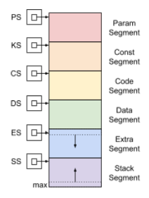

<h3>Tabla de descriptores de segmentos</h3>

&nbsp;&nbsp;&nbsp;&nbsp;La tabla de descriptores de segmentos se mantiene igual que en la primera parte. Sin embargo, ahora solo deberán crearse entradas para los segmentos que tengan un tamaño mayor a cero. Esto quiere decir que la posición de cada segmento en la tabla no será siempre la misma. El orden de los segmentos en la tabla debe ser el mismo que su ubicación física en la memoria principal.

&nbsp;&nbsp;&nbsp;&nbsp;La construcción de la tabla debe ser posterior a la creación del Param Segment, si es que se definieron parámetros en la ejecución. Nótese que la ubicación de cada segmento en la memoria pueden variar de una ejecución a otra con el mismo .vmx, variando la cantidad de parámetros ingresados.

<h3>Registros</h3>

&nbsp;&nbsp;&nbsp;&nbsp;Los registros quedarán dispuestos de la siguiente manera:

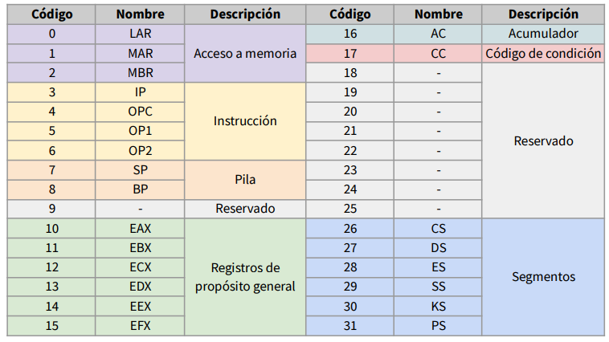

&nbsp;&nbsp;&nbsp;&nbsp;Antes de comenzar la ejecución, la máquina virtual debe inicializar los registros CS, DS, ES, SS, KS y PS con los punteros al comienzo de sus respectivos segmentos. Si alguno de los segmentos no existe (su tamaño es igual a cero), su respectivo registro deberá quedar cargado con un -1 (0xFFFFFFFF).

&nbsp;&nbsp;&nbsp;&nbsp;El registro SP es un puntero al tope de la pila. Inicialmente, la pila estará vacía, porque debe inicializarse con el valor del SS + el tamaño de la pila. En su estado inicial, el registro SP apunta a una posición de memoria fuera del Stack Segment.

&nbsp;&nbsp;&nbsp;&nbsp;El registro BP también se utiliza para referenciar posiciones de la pila. Sin embargo, en principio norequiere ninguna inicialización, sino que será cuestión del programador utilizarlo correctamente.

<h3>Instrucciones en lenguaje máquina</h3>
<h3>Códigos de operación</h3>

&nbsp;&nbsp;&nbsp;&nbsp;A continuación se listan las nuevas instrucciones a implementar, junto con sus códigos de operación asociados en hexadecimal, clasificadas según la cantidad de operandos.

<table align="center">
  <thead>  
    <tr>
      <th colspan="2"><strong>1 Operando</strong></th>
      <th colspan="2"><strong>0 Operandos</strong></th>
    </tr>
  </thead>
  <tbody>  
    <tr>
      <td><strong>Mnemónico</strong></td>
      <td><strong>Código</strong></td>
      <td><strong>Mnemónico</strong></td>
      <td><strong>Código</strong></td>
    </tr>
    <tr>
      <td>PUSH</td>
      <td>0B</td>
      <td>RET</td>
      <td>0E</td>
    </tr>
    <tr>
      <td>POP</td>
      <td>0C</td>
      <td></td>
      <td></td>
    </tr>
    <tr>
      <td>CALL</td>
      <td>0D</td>
      <td></td>
      <td></td>
    </tr>
  </tbody>
</table>

<h3>Operandos</h3>

&nbsp;&nbsp;&nbsp;&nbsp;<strong>Operando de registro:</strong> los dos bits más significativos indican el sector de registro, de acuerdo a la siguiente codificación:

 
  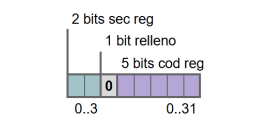

  <table align="end">
    <thead>  
      <tr>
        <th><strong>Código binario</strong></th>
        <th><strong>Descripción</strong></th>
        <th><strong>Ejemplo</strong></th>
      </tr>
    </thead>
    <tbody>  
      <tr>
        <td>00</td>
        <td>registro de 4 bytes</td>
        <td>EAX</td>
      </tr>
      <tr>
        <td>01</td>
        <td>4to byte del registro</td>
        <td>AL</td>
      </tr>
      <tr>
        <td>10</td>
        <td>3er byte del registro</td>
        <td>AH</td>
      </tr>
      <tr>
        <td>11</td>
        <td>registro de 2 bytes</td>
        <td>AX</td>
      </tr>
    </tbody>
  </table>

&nbsp;&nbsp;&nbsp;&nbsp;<strong>Operando de memoria:</strong> los dos bits más significativos indican el tamaño de la celda a leer o escribir,de acuerdo a la siguiente codificación:

 
  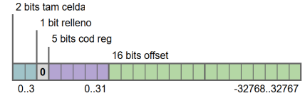
  <table align="end">
    <thead>  
      <tr>
        <th><strong>Código binario</strong></th>
        <th><strong>Tamaño de la celda</strong></th>
      </tr>
    </thead>
    <tbody>  
      <tr>
        <td>00</td>
        <td>long (l)</td>
      </tr>
      <tr>
        <td>10</td>
        <td>word (w)</td>
      </tr>
      <tr>
        <td>11</td>
        <td>byte (b)</td>
      </tr>
    </tbody>
  </table>

<h3>Manejo de pila</h3>

&nbsp;&nbsp;&nbsp;&nbsp; Si bien el correcto uso de la pila queda bajo la responsabilidad del programador, se debe tener en cuenta la estricta implementación de las operaciones que se realizan sobre la misma. Las instrucciones <strong>PUSH</strong>, <strong>POP</strong>, <strong>CALL</strong> y <strong>RET</strong>, por las cuales el programador utiliza la pila, siempre almacenan o extraen 4 bytes, aunque los operandos no sean de 4 bytes (en el caso de <strong>PUSH</strong> y <strong>POP</strong>). Tanto al almacenar como al extraer un valor en la pila, el orden de los bytes es big endian, al igual que las operaciones de memoria sobre otros segmentos.

&nbsp;&nbsp;&nbsp;&nbsp;La pila crece hacia las direcciones inferiores de la memoria, por lo tanto cuando se está <strong>agregando</strong> a la pila se <strong>decrementa</strong> el valor del SP, y cuando se está <strong>quitando</strong> de la pila se <strong>incrementa</strong> el valor del SP.

&nbsp;&nbsp;&nbsp;&nbsp; La instrucción <strong>PUSH</strong> debe seguir estrictamente los pasos:

<ol>
  <li>Decrementar el valor del SP en 4.</li>
  <li>Si el valor de <strong>SP</strong> es menor que el valor del registro <strong>SS</strong>, entonces será un <strong>STACK OVERFLOW</strong> y se aborta la ejecución de la máquina virtual.</li>
  <li>Obtener el valor del operando (sea inmediato, de registro o de memoria).</li>
  <li>Transformar el valor obtenido a 4 bytes (al igual que con cualquier operación).</li>
  <li>Almacenar en la pila desde los bytes menos significativos del valor, dejando en el tope el byte más significativo.</li>
</ol>

&nbsp;&nbsp;&nbsp;&nbsp;Por ejemplo: PUSH AX, decrementar el valor de <strong>SP</strong> en 4, si EAX = 0x1234ABCD se toman los 2 bytes menos significativos (AX), 0xABCD, se lo transforma en 4 bytes, 0xFFFFABCD (propagando el signo), y se almacena en la pila, quedando el SP apuntando al byte más significativo del valor.

&nbsp;&nbsp;&nbsp;&nbsp;La instrucción <strong>POP</strong> debe realizar la operatoria inversa:

<ol>
  <li>Extraer 4 bytes desde el tope de la pila.</li>
  <li>Si al realizar esta acción, no se pudo completar porque no había bytes suficientes o la pila estaba vacía, entonces será un <strong>STACK UNDERFLOW</strong> y se aborta la ejecución.</li>
  <li>Convertir los 4 bytes extraídos en un valor, el cual tendrá en el byte más significativo lo que estaba en el tope de la pila, y continúa en orden hasta el menos significativo.</li>
  <li>Asignar el valor extraído al primer operando, si el operando es menor a 4 bytes se truncan los bytes más significativos.</li>
  <li>Incrementar el valor del SP en 4.</li>
</ol>

&nbsp;&nbsp;&nbsp;&nbsp;Nótese que la instrucción <strong>POP no modifica los valores de la pila</strong>, solo modifica el registro <strong>SP</strong>.

&nbsp;&nbsp;&nbsp;&nbsp;Continuando con el ejemplo: si luego se hace un POP w[ES+4], se leen los 4 bytes apuntados por SP y, por lo tanto, en el byte 4 del Extra Segment quedará 0xAB y en el byte 5 0xCD. Finalmente, se debe incrementar el valor del SP en 4. Aunque el valor leído sea 0xFFFFABCD, se debe asignar a 2 bytes (w[...]) y, al igual que en toda la máquina virtual, se truncan los bytes más significativos.

&nbsp;&nbsp;&nbsp;&nbsp;La instrucción <strong>CALL</strong> siempre almacenará en la pila los 4 bytes del valor del <strong>IP</strong> (que ya se encuentra apuntando a la siguiente instrucción) y luego modificará los 2 bytes menos significativos del IP con el valor del operando. Es decir, técnicamente la instrucción <strong>CALL subrut</strong> equivale a hacer <strong>PUSH IP</strong> y seguido un <strong>JMP subrut</strong> .

&nbsp;&nbsp;&nbsp;&nbsp;En el caso de la instrucción <strong>RET</strong>, modificará el <strong>IP</strong> obteniendolo del tope de la pila. Por lo tanto, una instrucción <strong>RET</strong>, equivale a <strong>POP IP</strong>.

<h3>Segmento de parámetros</h3>

&nbsp;&nbsp;&nbsp;&nbsp;  El Param Segment es un segmento que se crea según los parámetros de ejecución, si es que estos se encuentran indicados en la línea de comandos. Debe construirse previo a la ejecución y configuración de la tabla de segmentos. De existir, siempre se ubicará a partir de la dirección física 0x00000000 de la memoria, dado que será el primer segmento del proceso y la máquina virtual solo ejecuta un único proceso; por lo tanto, estará definido en la posición 0 de la tabla de segmentos.

&nbsp;&nbsp;&nbsp;&nbsp;El contenido del segmento será: primero, todas las cadenas de caracteres (strings) de los parámetros; al final, un arreglo <strong>argv</strong> de tamaño <strong>argc</strong> de punteros de 4 bytes a cada posición de inicio de los strings de cada parámetro, siendo <strong>argc</strong> la cantidad de parámetros. Los punteros contendrán en los 16 bits menos significativos el offset de cada string dentro del segmento y en los 16 bits más significativos 0x0000, la entrada a la tabla de segmentos.

&nbsp;&nbsp;&nbsp;&nbsp;Ejemplo:

&nbsp;&nbsp;&nbsp;&nbsp;vmx program.vmx -p probando 01 2

&nbsp;&nbsp;&nbsp;&nbsp;Aquí se definieron tres parámetros: “probando”, “01” y “2” y se dispondrán en el Param Segment de la siguiente manera:

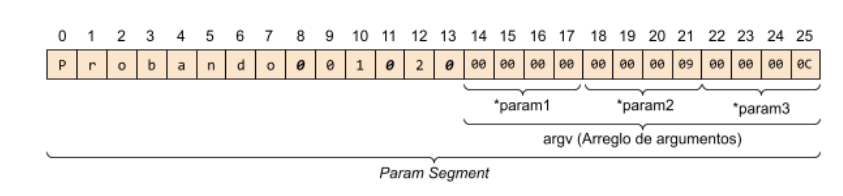

&nbsp;&nbsp;&nbsp;&nbsp;De este modo el queda construido el Param Segment con un tamaño de 26 bytes, 14 de los cuales están ocupados con los strings y 12 por el arreglo de punteros a los strings.

<h3>Subrutina principal</h3>

&nbsp;&nbsp;&nbsp;&nbsp;La ejecución de un nuevo programa debe comenzar en la subrutina principal, por lo que la máquina virtual debe inicializar el registro IP con la posición del Code Segment en los 16 bits más significativos y con el offset del entry point en los 16 bits menos significativos. La pila debe quedar cargada de la siguiente manera:

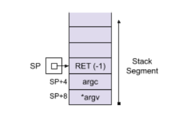

&nbsp;&nbsp;&nbsp;&nbsp;El valor de la dirección de retorno de la subrutina principal debe ser -1 (0xFFFFFFFF), de manera tal que el proceso finalice al ejecutar la instrucción RET, ya que el registro IP quedará cargado con un puntero fuera de Code Segment.

&nbsp;&nbsp;&nbsp;&nbsp;Los parámetros de la subrutina principal (cadenas de caracteres), de encontrarse definidos, se encuentran en el Param Segment. En la pila debe quedar a continuación: la cantidad de argumentos (argc) y el puntero a la posición inicial del arreglo de argumentos (argv).

&nbsp;&nbsp;&nbsp;&nbsp;En el caso de que no se especifique ningún parámetro, igualmente debe cargarse en la pila la dirección de retorno de la subrutina principal, 0 (0x00000000) en la cantidad de argumentos (argc) y -1 (0xFFFFFFFF) como puntero al arreglo de argumentos (argv).

<h3>Llamadas al sistema</h3>

&nbsp;&nbsp;&nbsp;&nbsp; <strong>3 (STRING READ):</strong> almacena en un rango de celdas de memoria los datos leídos desde el teclado. Almacena lo que se lee en la posición de memoria apuntada por EDX. En CX (16 bits) se especifica la cantidad máxima de caracteres a leer. Si CX tiene -1 no se limita la cantidad de caracteres a leer.

&nbsp;&nbsp;&nbsp;&nbsp; <strong>4 (STRING WRITE):</strong> imprime por pantalla un rango de celdas donde se encuentra un string. Inicia en la posición de memoria apuntada por EDX, e imprime hasta encontrar un '\0' (0x00).

&nbsp;&nbsp;&nbsp;&nbsp; <strong>7 (CLEAR SCREEN):</strong> ejecuta una limpieza de pantalla. No requiere ningún registro configurado y
tampoco modifica ninguno.

&nbsp;&nbsp;&nbsp;&nbsp; <strong>F (BREAKPOINT):</strong> si existe un archivo .vmi en los parámetros de ejecución, pausa la ejecución, genera una imagen con el estado actual de la máquina virtual en ese archivo y queda en espera de una acción del usuario para debug (se explica a continuación). No requiere ningún registro configurado y tampoco modifica ninguno.

<h3>Herramientas de depuración</h3>
<h3>Breakpoint</h3>

&nbsp;&nbsp;&nbsp;&nbsp; Los breakpoints son un tipo de llamada al sistema especial que permiten pausar o detener la ejecución para observar el estado actual de la máquina virtual. Estas llamadas al sistema deben ser ignoradas si al momento de ejecutar la máquina virtual no se ha incluido el parámetro que indica el archivo de imagen.

&nbsp;&nbsp;&nbsp;&nbsp; Cuando se ejecuta un breakpoint, la máquina virtual debe pausar su ejecución y generar un archivo de imagen. Luego, debe quedar a la espera de que el usuario realice una de las siguientes acciones:

<ul>
  <li>Si se ingresa el carácter 'g' (go), la máquina virtual continúa su ejecución hasta el próximo breakpoint o hasta finalizar la ejecución.</li>
  <li>Si se ingresa el carácter 'q' (quit), la máquina virtual aborta la ejecución, dejando intacto el archivo .vmi de modo que se pueda retomar la ejecución del mismo.</li>
  <li>Si únicamente se presiona la tecla Enter, la máquina virtual debe ejecutar la siguiente instrucción y luego volver a realizar un nuevo breakpoint, sin importar qué haga dicha instrucción. Esto posibilita que el código pueda ser ejecutado paso a paso.</li>
</ul>

<h3>Debugger</h3>

&nbsp;&nbsp;&nbsp;&nbsp; El debugger, provisto por la cátedra, permite visualizar en tiempo real el estado de la máquina. Una vez que se encuentra en ejecución, monitorea constantemente un archivo de imagen y actualiza su salida por pantalla ante cualquier cambio en el mismo. Permite visualizar el código assembler desensamblado, la ubicación del registro IP, los valores de todos los registros y la tabla de descriptores de segmentos. Así mismo, permite realizar las siguientes acciones:

<ul>
  <li>Si se ingresa un valor inmediato o un intervalo (dos valores), se muestra el contenido de las celdas de memoria en esas direcciones físicas.</li>
  <li>Si se ingresa el carácter 'q' (quit), el debugger finaliza su ejecución.</li>
</ul>

&nbsp;&nbsp;&nbsp;&nbsp; Se utiliza por consola del siguiente modo:

vmg filename.vmi [-r] [-s] [w=W]

&nbsp;&nbsp;&nbsp;&nbsp; Donde:

<ul>
  <li><strong>vmg</strong> es el programa ejecutable del debugger.</li>
  <li><strong>filename.vmi</strong> (obligatorio) es la ruta y nombre del archivo donde se almacenará la imagen de la máquina virtual (puede ser cualquier nombre con extensión .vmi).</li>
  <li><strong>-r</strong> (opcional) es un flag que le indica al debugger que muestre los valores de los registros.</li>
  <li><strong>-s</strong> (opcional) es un flag que le indica al debugger que muestre los valores de los segmentos.</li>
  <li><strong>w=W</strong> (opcional) permite indicar el tamaño de la ventana de código, donde W es un valor que indica la cantidad de líneas de código a mostrar (alrededor de la apuntada por el registro IP).</li>
</ul>
<h3>Errores</h3>

&nbsp;&nbsp;&nbsp;&nbsp; Además de los errores descritos en la primera parte, la máquina virtual debe ser capaz de detectar:

<ul>
  <li><strong>Memoria insuficiente:</strong> cuando la memoria principal no cuenta con espacio suficiente para alojar todos los segmentos del proceso.</li>
  <li><strong>Stack overflow:</strong> cuando se ejecuta una instrucción PUSH o CALL y no haya espacio suficiente en la pila.</li>
  <li><strong>Stack underflow:</strong> cuando se ejecuta una instrucción POP o RET y la pila ya está vacía o no puede extraer los 4 bytes correspondientes.</li>
</ul>

&nbsp;&nbsp;&nbsp;&nbsp; Ante la ocurrencia de cualquiera de estos errores, la máquina virtual debe informarlo e inmediatamente abortar la ejecución del proceso.

<h3>Disassembler</h3>

&nbsp;&nbsp;&nbsp;&nbsp; En esta segunda parte, si a la máquina virtual se le indica que muestre el código Assembler (<strong>-d</strong>), también deberá mostrar las cadenas de caracteres constantes con el siguiente formato:

[0000] XX XX XX XX | "abc..."

<ul>
  <li><strong>[0000]</strong> es la dirección de memoria donde está alojada la cadena de caracteres, expresada con 4 dígitos hexadecimales.</li>
  <li><strong>XX XX XX XX</strong> es la cadena de caracteres en hexadecimal (incluyendo el '\0'), agrupada por bytes. Si se superan los 7 bytes, se deben mostrar los primeros 6, seguido de dos puntos (..) para indicar que la cadena continúa.</li>
  <li><strong>"abc..."</strong> es la cadena de caracteres completa entre comillas ("). Cuando el caracter ASCII no es imprimible, debe escribir un punto (.) en su lugar.</li>
</ul>

&nbsp;&nbsp;&nbsp;&nbsp; Además, se deberá indicar con el símbolo mayor (>) la ubicación del entry point. También deberán visualizarse los “pseudónimos” de los sectores de registros y los modificadores (prefijos) de los operandos de memoria.

&nbsp;&nbsp;&nbsp;&nbsp; Por ejemplo:

  
&nbsp;&nbsp;&nbsp;&nbsp; [0000] 56 4D 58 32 35 00 | "VMX25"

  
&nbsp;&nbsp;&nbsp;&nbsp; [0006] 61 62 63 08 0A 0D 00 | "abc..."

  
&nbsp;&nbsp;&nbsp;&nbsp; [000D] 41 72 71 75 69 74 .. | "Arquitectura de Computadoras"

  
&nbsp;&nbsp;&nbsp;&nbsp; >[002A] B1 00 0A 9B 00 05 | ADD w[DS+5], 10

  
&nbsp;&nbsp;&nbsp;&nbsp; [0030] 96 00 08 CA | SHL AX, 8

  
&nbsp;&nbsp;&nbsp;&nbsp; [0034] 48 8E | NOT EH

